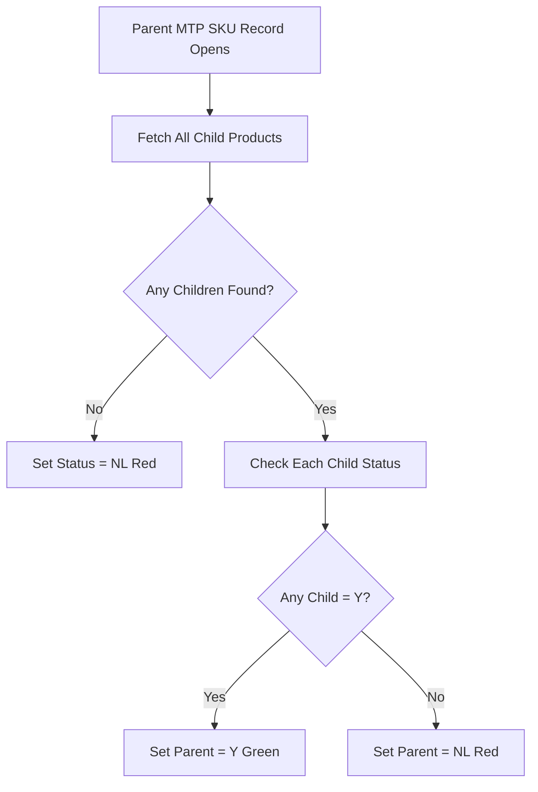

# Deployment Guide: Parent MTP SKU Live Status

## 📋 Prerequisites (MUST DO FIRST!)

### Step 1: Create Product_Active Field (Optional)
> **Note:** This field is optional for this implementation. The script works based on child product statuses only.

If you want to manually control parent status:
1. Go to **Zoho CRM** → Setup → Modules → **Parent_MTP_SKU** → Fields
2. Click **"New Field"**
3. **Field Type:** Checkbox (Boolean)
4. **Field Label:** Product Active
5. **API Name:** Product_Active
6. **Default Value:** Unchecked
7. Click **Save**

### Step 2: Verify Live_Status Field Exists
1. Go to **Zoho CRM** → Setup → Modules → **Parent_MTP_SKU** → Fields
2. Confirm **Live_Status** field exists with these values:
   - Y - Live
   - YB - Live with balancing Material
   - YD - Live til Diwali
   - RL - Relaunch
   - NL - New Launch

---

## 🚀 Deployment Steps

### Option A: Automated Deployment (Coming Soon)
```bash
node deploy-client-script.js --file generated/parent_mtp_sku_live_status.js --module Parent_MTP_SKU
```

### Option B: Manual Deployment (Use This Now)

#### 1. Copy the Generated Code
- File location: `generated/parent_mtp_sku_live_status.js`
- Copy the entire contents

#### 2. Create Client Script in Zoho CRM

1. **Login to Zoho CRM**
   - Go to https://crm.zoho.com

2. **Navigate to Client Scripts**
   - Click **Setup** (⚙️ icon)
   - Go to **Developer Hub** → **Client Script**

3. **Create New Script**
   - Click **"+ New Script"** button
   
4. **Configure Script Settings**
   - **Script Name:** `Parent MTP SKU Live Status Aggregator`
   - **Description:** `Auto-updates parent Live_Status based on child product statuses`
   - **Module:** **Parent_MTP_SKU**

5. **Paste the Code**
   - In the code editor, paste the entire contents from `parent_mtp_sku_live_status.js`

6. **Set Triggers**
   - **On Load:** ✅ Checked
   - **On Field Change:** ✅ Checked
     - Select field: **Product_Active** (if you created it)
     - Or leave empty to only trigger on load

7. **Save the Script**
   - Click **Save**

---

## 🧪 Testing

### Test Case 1: Parent with Live Child
1. Open any **Parent_MTP_SKU** record
2. Verify it has at least one child Product with `Live_Status = Y`
3. **Expected Result:** Parent shows `Live_Status = Y` (green)

### Test Case 2: Parent with All Inactive Children
1. Open a **Parent_MTP_SKU** record
2. Verify ALL child Products have `Live_Status ≠ Y` (e.g., NL, RL, etc.)
3. **Expected Result:** Parent shows `Live_Status = NL` (red)

### Test Case 3: Parent with No Children
1. Open a **Parent_MTP_SKU** record with no linked Products
2. **Expected Result:** Parent shows `Live_Status = NL` (red)

### Test Case 4: Mixed Children
1. Open a **Parent_MTP_SKU** record
2. Ensure it has:
   - 1 child with `Live_Status = Y`
   - 3 children with `Live_Status = NL`
3. **Expected Result:** Parent shows `Live_Status = Y` (green) - because at least ONE child is live

---

## 🔍 How It Works

### Logic Flow



### Key Features
- ✅ **Automatic aggregation** - Checks all child products
- ✅ **Real-time updates** - Updates on page load
- ✅ **Visual indicators** - Green for live, Red for inactive
- ✅ **Read-only field** - Prevents manual editing
- ✅ **Error handling** - Shows orange if API fails

---

## 📊 Status Color Coding

| Status | Color | Meaning |
|--------|-------|---------|
| Y | 🟢 Green (#00cc00) | At least one child product is live |
| NL | 🔴 Red (#ff0000) | All children are inactive or no children |
| Error | 🟠 Orange (#ff9900) | API error occurred |

---

## ⚠️ Important Notes

### Production Environment
- ✅ **Read-only operation** - Only reads child data
- ✅ **No data modification** - Only updates Live_Status field
- ✅ **Reversible** - Can disable script anytime
- ⚠️ **Performance** - May be slow if parent has 100+ children

### Limitations
- Script runs on **page load** only (not real-time when child changes)
- To update parent status after child changes:
  - Option 1: Refresh parent record page
  - Option 2: Add workflow to trigger parent update (advanced)

---

## 🔄 Updating Child Products Workflow (Optional Enhancement)

If you want parent status to update automatically when child products change:

### Create Workflow Rule in Products Module
1. Go to **Setup** → **Automation** → **Workflow Rules**
2. Create rule for **Products** module
3. **Trigger:** When record is updated
4. **Condition:** `Live_Status` is modified
5. **Action:** Call custom function to update parent (requires Deluge function)

**Note:** This is an advanced feature. Let me know if you want me to generate this workflow!

---

## 🆘 Troubleshooting

### Issue: Parent status not updating
**Solution:**
1. Check browser console for errors (F12)
2. Verify `Live_Status` field exists in Parent_MTP_SKU
3. Verify child Products have `MTP_SKU` lookup field populated

### Issue: Shows NL even though child is Y
**Solution:**
1. Check the `MTP_SKU` field in child Products
2. Verify it points to the correct parent record
3. Check search query in browser console

### Issue: Script not running
**Solution:**
1. Verify Client Script is **enabled**
2. Check triggers are set correctly
3. Clear browser cache and reload

---

## ✅ Deployment Checklist

- [ ] Live_Status field exists in Parent_MTP_SKU
- [ ] (Optional) Product_Active field created
- [ ] Code copied from generated file
- [ ] Client Script created in Zoho CRM
- [ ] Module set to Parent_MTP_SKU
- [ ] Triggers configured (On Load)
- [ ] Script saved and enabled
- [ ] Tested with live child product
- [ ] Tested with inactive children
- [ ] Tested with no children

---

> [!TIP]
> **Quick Test:** Open any Parent MTP SKU record and check if the Live_Status field updates automatically with the correct color!

> [!WARNING]
> **Production Deployment:** Test thoroughly before deploying to production. Consider testing in sandbox environment first if available.
