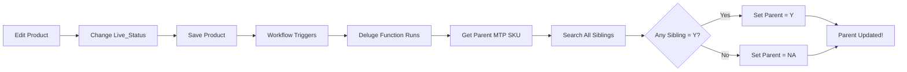

# Workflow Setup: Auto-Update Parent MTP SKU Status

## 📋 Overview

This workflow automatically updates the Parent MTP SKU's `ProductActive` field whenever a child Product's `Live_Status` changes.

**Flow:**
```
Child Product Live_Status changes → Workflow triggers → Deluge function runs → Parent ProductActive updates
```

---

## 🚀 Setup Instructions

### Step 1: Create Deluge Function

1. **Go to Zoho CRM** → Setup → Developer Hub → **Functions**
2. **Click "New Function"**
3. **Configure:**
   - **Function Name:** `updateParentMTPStatus`
   - **Display Name:** `Update Parent MTP SKU Status`
   - **Description:** `Auto-updates parent MTP SKU ProductActive based on child products`
   - **Category:** `Automation`

4. **Paste the code** from:
   ```
   generated/update_parent_mtp_status.deluge
   ```

5. **Configure Arguments:**
   - **Argument Name:** `productId`
   - **Type:** `Number`

6. **Click "Save"**

---

### Step 2: Create Workflow Rule

1. **Go to Zoho CRM** → Setup → Automation → **Workflow Rules**
2. **Click "Create Rule"**

3. **Basic Information:**
   - **Module:** `Products`
   - **Rule Name:** `Update Parent MTP Status on Live Status Change`
   - **Description:** `Triggers parent update when child Live_Status changes`

4. **When to Execute:**
   - **On:** `Create or Edit` ✅
   - **Execute on Field Update:** ✅ Check this
   - **Select Field:** `Live_Status`

5. **Condition:**
   - **No condition needed** (always execute when Live_Status changes)
   - Or add: `MTP_SKU is not empty` (to ensure product has a parent)

6. **Instant Actions:**
   - **Click "Add Action"** → **Custom Functions**
   - **Select Function:** `updateParentMTPStatus`
   - **Pass Parameter:**
     ```
     ${Products.Id}
     ```
   - This passes the current Product's ID to the function

7. **Click "Save"**

---

## 🧪 Testing

### Test Case 1: Change Child Status to Y
1. Open a **Product** record that has a parent MTP SKU
2. Change `Live_Status` to **Y**
3. **Save** the Product
4. **Open the Parent MTP SKU** record
5. **Expected:** `ProductActive` should be **Y**

### Test Case 2: Change All Children to Inactive
1. Open all Products under one parent
2. Change all their `Live_Status` to **NL** or **RL** (not Y)
3. **Save** each Product
4. **Open the Parent MTP SKU** record
5. **Expected:** `ProductActive` should be **NA**

### Test Case 3: Mixed Status
1. Parent has 3 children
2. Set 1 child to **Y**, others to **NL**
3. **Expected:** Parent `ProductActive` = **Y**
4. Change the Y child to **NL**
5. **Expected:** Parent `ProductActive` = **NA**

---

## 🔍 How It Works

### When You Change a Child Product:



### The Function:
1. Gets the parent MTP SKU from the child Product
2. Searches ALL products with the same parent
3. Checks if ANY has `Live_Status = Y`
4. Updates parent's `ProductActive` accordingly

---

## ⚠️ Important Notes

### Execution Limits
- Workflow runs **every time** Live_Status changes
- If you bulk update 100 products, function runs 100 times
- Zoho has daily API limits (check your plan)

### Performance
- Function searches all sibling products each time
- If parent has 100+ children, may be slow
- Consider caching or optimization if needed

### Field Names
- **Parent Module:** `Parent_MTP_SKU`
- **Parent Field:** `ProductActive`
- **Child Module:** `Products`
- **Child Lookup:** `MTP_SKU`
- **Child Status:** `Live_Status`

**If any field names are different, update the Deluge code!**

---

## 🐛 Troubleshooting

### Parent not updating
1. **Check Workflow is Active**
   - Go to Workflow Rules
   - Ensure rule is **Enabled**

2. **Check Function Logs**
   - Go to Functions → updateParentMTPStatus
   - Click "Execution Logs"
   - Look for errors

3. **Verify Field Names**
   - Ensure `ProductActive` exists in Parent_MTP_SKU
   - Ensure `MTP_SKU` lookup exists in Products
   - Ensure `Live_Status` exists in Products

### Function errors
- Check execution logs for detailed error messages
- Verify the Product has a parent MTP SKU
- Ensure parent record is not locked

---

## ✅ Deployment Checklist

- [ ] Deluge function created
- [ ] Function argument configured (productId)
- [ ] Function saved successfully
- [ ] Workflow rule created on Products module
- [ ] Workflow triggers on Live_Status field change
- [ ] Workflow calls updateParentMTPStatus function
- [ ] Workflow passes ${Products.Id} parameter
- [ ] Workflow is Active/Enabled
- [ ] Tested with Y status
- [ ] Tested with NA status
- [ ] Tested with mixed statuses

---

## 🎯 Result

After setup, the parent's `ProductActive` will **automatically update** whenever:
- You create a new Product with a parent
- You change any Product's Live_Status
- You delete a Product (may need additional workflow)

**No manual refresh needed!** The parent status updates in real-time. 🚀
